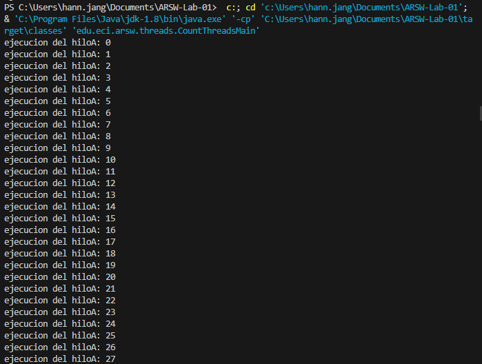
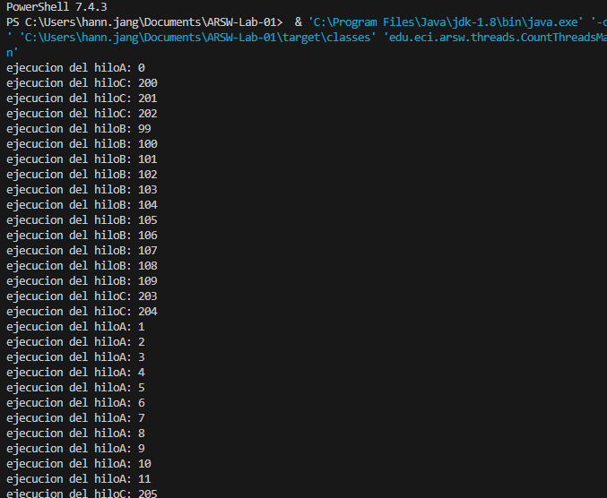
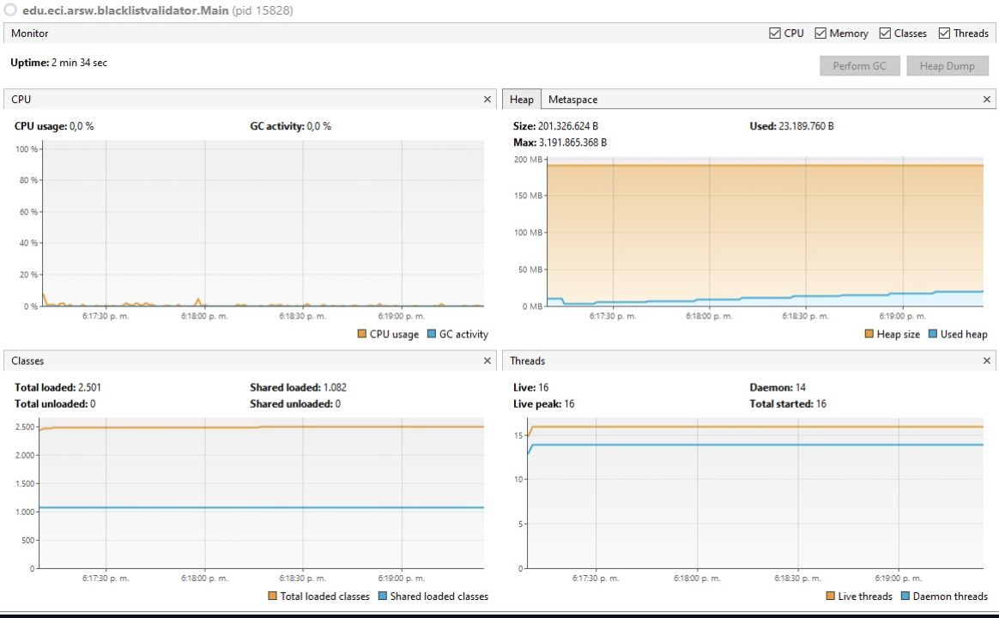
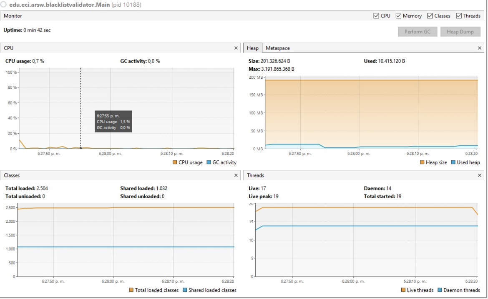
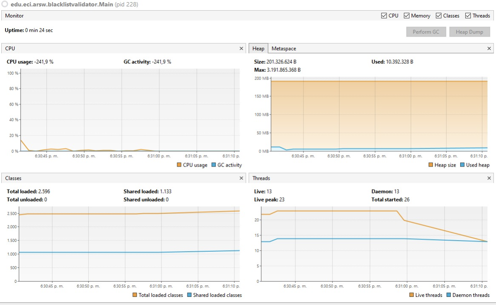

### Escuela Colombiana de Ingeniería
### Arquitecturas de Software - ARSW
## Ejercicio Introducción al paralelismo - Hilos - Caso BlackListSearch

## Realizado por: Hann Jang y Cesar David Amaya Gomez

### Dependencias:
####   Lecturas:
*  [Threads in Java](http://beginnersbook.com/2013/03/java-threads/)  (Hasta 'Ending Threads')
*  [Threads vs Processes]( http://cs-fundamentals.com/tech-interview/java/differences-between-thread-and-process-in-java.php)

### Descripción
  Este ejercicio contiene una introducción a la programación con hilos en Java, además de la aplicación a un caso concreto.
  

**Parte I - Introducción a Hilos en Java**

1. De acuerdo con lo revisado en las lecturas, complete las clases CountThread, para que las mismas definan el ciclo de vida de un hilo que imprima por pantalla los números entre A y B.
2. Complete el método __main__ de la clase CountMainThreads para que:
	1. Cree 3 hilos de tipo CountThread, asignándole al primero el intervalo [0..99], al segundo [99..199], y al tercero [200..299].
	2. Inicie los tres hilos con 'start()'.
	3. Ejecute y revise la salida por pantalla. 
	4. Cambie el incio con 'start()' por 'run()'. Cómo cambia la salida?, por qué?.

	Cuando se utiliza el método run(), los hilos se ejecutan de manera secuencial, es decir, uno tras otro, sin aprovechar el paralelismo. Esto significa que el segundo hilo no comenzará hasta que el primero haya terminado, y así sucesivamente. Por otro lado, al usar el método start(), los hilos se ejecutan de manera concurrente, permitiendo que el programa aproveche el paralelismo y la ejecución no sea determinista.

3. Imagenes de Pruebas: 

**Parte II - Ejercicio Black List Search**

Para un software de vigilancia automática de seguridad informática se está desarrollando un componente encargado de validar las direcciones IP en varios miles de listas negras (de host maliciosos) conocidas, y reportar aquellas que existan en al menos cinco de dichas listas. 

Dicho componente está diseñado de acuerdo con el siguiente diagrama, donde:

- HostBlackListsDataSourceFacade es una clase que ofrece una 'fachada' para realizar consultas en cualquiera de las N listas negras registradas (método 'isInBlacklistServer'), y que permite también hacer un reporte a una base de datos local de cuando una dirección IP se considera peligrosa. Esta clase NO ES MODIFICABLE, pero se sabe que es 'Thread-Safe'.

- HostBlackListsValidator es una clase que ofrece el método 'checkHost', el cual, a través de la clase 'HostBlackListDataSourceFacade', valida en cada una de las listas negras un host determinado. En dicho método está considerada la política de que al encontrarse un HOST en al menos cinco listas negras, el mismo será registrado como 'no confiable', o como 'confiable' en caso contrario. Adicionalmente, retornará la lista de los números de las 'listas negras' en donde se encontró registrado el HOST.

Al usarse el módulo, la evidencia de que se hizo el registro como 'confiable' o 'no confiable' se dá por lo mensajes de LOGs:

INFO: HOST 205.24.34.55 Reported as trustworthy

INFO: HOST 205.24.34.55 Reported as NOT trustworthy

Al programa de prueba provisto (Main), le toma sólo algunos segundos análizar y reportar la dirección provista (200.24.34.55), ya que la misma está registrada más de cinco veces en los primeros servidores, por lo que no requiere recorrerlos todos. Sin embargo, hacer la búsqueda en casos donde NO hay reportes, o donde los mismos están dispersos en las miles de listas negras, toma bastante tiempo.

Éste, como cualquier método de búsqueda, puede verse como un problema [vergonzosamente paralelo](https://en.wikipedia.org/wiki/Embarrassingly_parallel), ya que no existen dependencias entre una partición del problema y otra.

Para 'refactorizar' este código, y hacer que explote la capacidad multi-núcleo de la CPU del equipo, realice lo siguiente:

1. Cree una clase de tipo Thread que represente el ciclo de vida de un hilo que haga la búsqueda de un segmento del conjunto de servidores disponibles. Agregue a dicha clase un método que permita 'preguntarle' a las instancias del mismo (los hilos) cuantas ocurrencias de servidores maliciosos ha encontrado o encontró.

2. Agregue al método 'checkHost' un parámetro entero N, correspondiente al número de hilos entre los que se va a realizar la búsqueda (recuerde tener en cuenta si N es par o impar!). Modifique el código de este método para que divida el espacio de búsqueda entre las N partes indicadas, y paralelice la búsqueda a través de N hilos. Haga que dicha función espere hasta que los N hilos terminen de resolver su respectivo sub-problema, agregue las ocurrencias encontradas por cada hilo a la lista que retorna el método, y entonces calcule (sumando el total de ocurrencuas encontradas por cada hilo) si el número de ocurrencias es mayor o igual a _BLACK_LIST_ALARM_COUNT_. Si se da este caso, al final se DEBE reportar el host como confiable o no confiable, y mostrar el listado con los números de las listas negras respectivas. Para lograr este comportamiento de 'espera' revise el método [join](https://docs.oracle.com/javase/tutorial/essential/concurrency/join.html) del API de concurrencia de Java. Tenga también en cuenta:

	* Dentro del método checkHost Se debe mantener el LOG que informa, antes de retornar el resultado, el número de listas negras revisadas VS. el número de listas negras total (línea 60). Se debe garantizar que dicha información sea verídica bajo el nuevo esquema de procesamiento en paralelo planteado.

	* Se sabe que el HOST 202.24.34.55 está reportado en listas negras de una forma más dispersa, y que el host 212.24.24.55 NO está en ninguna lista negra.

**Parte II.I Para discutir la próxima clase (NO para implementar aún)**

La estrategia de paralelismo antes implementada es ineficiente en ciertos casos, pues la búsqueda se sigue realizando aún cuando los N hilos (en su conjunto) ya hayan encontrado el número mínimo de ocurrencias requeridas para reportar al servidor como malicioso. Cómo se podría modificar la implementación para minimizar el número de consultas en estos casos?, qué elemento nuevo traería esto al problema?

Respuesta
La estrategia de paralelismo antes implementada es ineficiente en ciertos casos, pues la búsqueda se sigue realizando aún cuando los N hilos (en su conjunto) ya hayan encontrado el número mínimo de ocurrencias requeridas para reportar al servidor como malicioso. 

Para mejorar la eficiencia, podríamos introducir una comunicación entre los hilos que les permita detenerse tan pronto como se alcance el umbral necesario de ocurrencias. Para lograr esto, podríamos usar una barrera de comunicación, como un `CountDownLatch`, que permita que todos los hilos detengan sus búsquedas una vez que se haya alcanzado el umbral. 

Otra técnica podría ser "Dividir y Conquistar" donde se dividiría el conjunto de servidores en segmentos más pequeños, donde cada segmento buscaría en paralelo. A medida que los hilos encuentren las ocurrencias necesarias, podrían detenerse y dejar de buscar en ese segmento, reduciendo así la cantidad total de búsquedas realizadas. En este último caso, se haría uso de `AtomicInteger` para contar las ocurrencias.

**Parte III - Evaluación de Desempeño**

A partir de lo anterior, implemente la siguiente secuencia de experimentos para realizar las validación de direcciones IP dispersas (por ejemplo 202.24.34.55), tomando los tiempos de ejecución de los mismos (asegúrese de hacerlos en la misma máquina):

1. Un solo hilo.

2. Tantos hilos como núcleos de procesamiento (haga que el programa determine esto haciendo uso del [API Runtime](https://docs.oracle.com/javase/7/docs/api/java/lang/Runtime.html)).

3. Tantos hilos como el doble de núcleos de procesamiento.

4. 50 hilos.

5. 100 hilos.

Al iniciar el programa ejecute el monitor jVisualVM, y a medida que corran las pruebas, revise y anote el consumo de CPU y de memoria en cada caso. 

Con lo anterior, y con los tiempos de ejecución dados, haga una gráfica de tiempo de solución vs. número de hilos. Analice y plantee hipótesis con su compañero para las siguientes preguntas (puede tener en cuenta lo reportado por jVisualVM):

**Parte IV - Ejercicio Black List Search**

1. Según la [ley de Amdahls](https://www.pugetsystems.com/labs/articles/Estimating-CPU-Performance-using-Amdahls-Law-619/#WhatisAmdahlsLaw?):

	, donde _S(n)_ es el mejoramiento teórico del desempeño, _P_ la fracción paralelizable del algoritmo, y _n_ el número de hilos, a mayor _n_, mayor debería ser dicha mejora. Por qué el mejor desempeño no se logra con los 500 hilos?, cómo se compara este desempeño cuando se usan 200?. 

Si consideramos un escenario en el que P es 0.8 (80% del algoritmo es paralelizable) y calculamos la mejora teórica del desempeño para diferentes valores de n:

- Con n = 1, S(1) = 1 (Sin paralelismo)
- Con n = 2, S(2) = 1/0.6 = 1.67 (una mejora del 67% aproximadamente)
- Con n = 500, S(500) = 1/0.0016 = 4.96 (una mejora del 396% aproximadamente)
- Con n = 200, S(200) = 1/0.004 = 4.95 (una mejora del 395% aproximadamente)

Podemos observar que a medida que n aumenta, la mejora teórica del desempeño se aproxima a un valor límite. Sin embargo, el incremento en el desempeño se vuelve cada vez más pequeño. En el caso de n=500, aunque la mejora es considerable, no es proporcional al número de hilos utilizados.

Para 200 hilos, la mejora del desempeño es casi idéntica a la obtenida con 500 hilos, lo que demuestra que aumentar el número de hilos más allá de cierto punto no resulta en mejoras significativas de desempeño, debido a la fracción no paralelizable del algoritmo según la Ley de Amdahl.

En realidad, el desempeño entre 500 hilos y 200 hilos no varía significativamente, por lo que usar una cantidad tan alta de hilos puede ser un desperdicio de recursos. Es importante identificar el punto en el que aumentar el número de hilos deja de ser beneficioso.

2. Cómo se comporta la solución usando tantos hilos de procesamiento como núcleos comparado con el resultado de usar el doble de éste?.

Cuando se utiliza un número de hilos de procesamiento igual al número de núcleos, la solución tiende a ser más eficiente. Cada hilo puede ejecutarse en un núcleo separado, lo que maximiza el uso de los recursos disponibles sin incurrir en la sobrecarga de planificación y conmutación de hilos.

En contraste, al usar el doble de hilos que el número de núcleos, se intenta realizar un nivel de paralelismo mayor que la cantidad de recursos físicos disponibles. Esto puede resultar en una competencia entre hilos por el acceso a los núcleos de la CPU, lo que genera sobrecarga debido a la gestión de más hilos que núcleos. Como consecuencia, algunos hilos pueden experimentar retrasos mientras esperan su turno para ser ejecutados, lo que puede disminuir el rendimiento en comparación con el uso óptimo de hilos.

En resumen, usar tantos hilos como núcleos suele ser más eficiente que usar el doble de hilos, ya que evita la sobrecarga de planificación y conmutación de hilos y permite un uso más efectivo de los recursos disponibles.

3. De acuerdo con lo anterior, si para este problema en lugar de 100 hilos en una sola CPU se pudiera usar 1 hilo en cada una de 100 máquinas hipotéticas, la ley de Amdahls se aplicaría mejor?. Si en lugar de esto se usaran c hilos en 100/c máquinas distribuidas (siendo c es el número de núcleos de dichas máquinas), se mejoraría?. Explique su respuesta.

Considerando lo anterior, si en lugar de utilizar 100 hilos en una sola CPU se pudiera usar 1 hilo en cada una de 100 máquinas hipotéticas, la Ley de Amdahl se aplicaría de manera más efectiva. Esto se debe a que cada hilo tendría acceso exclusivo a los recursos de una máquina completa, eliminando la competencia por los núcleos y reduciendo el overhead de planificación y conmutación de hilos.

Por otro lado, si se usaran c hilos en 100/c máquinas distribuidas (donde c es el número de núcleos de dichas máquinas), también se mejoraría el rendimiento. En este caso, cada máquina estaría utilizando sus núcleos de manera óptima, y la carga de trabajo se distribuiría de manera más equilibrada. Esto reduciría la sobrecarga de gestión de hilos y permitiría un uso más eficiente de los recursos disponibles.

En resumen, ambas estrategias mejorarían el rendimiento en comparación con el uso de 100 hilos en una sola CPU, ya que reducirían la competencia por los recursos y la sobrecarga de gestión de hilos, permitiendo un paralelismo más efectivo.

